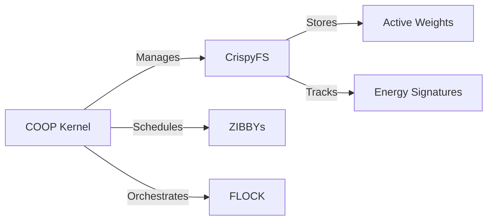
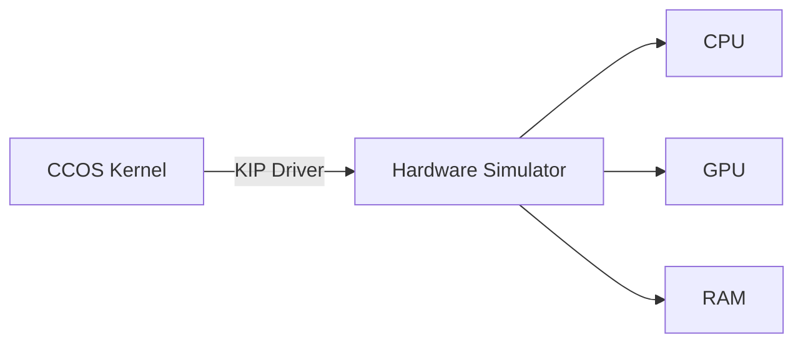
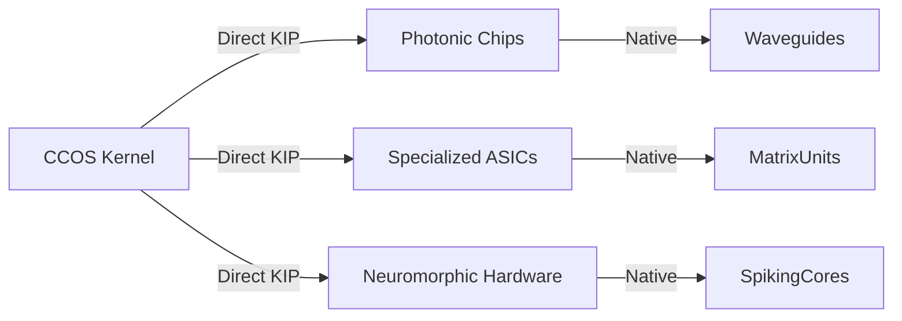

# Crispy Chicken 🍗 - The OS for Autonomous AI Swarms

[](LICENSE)
[](#status)
[](#performance)
[](https://discord.gg/invite-link)

**The revolutionary OS that collapses the traditional software stack for AI.** Crispy Chicken eliminates layers of abstraction to deliver unprecedented performance by fusing hardware capabilities with AI-native operations.

---

## 🔄 The Traditional AI Stack vs. CCOS Revolution

### 🐌 Traditional AI Stack (5 Layers of Abstraction)
```mermaid
flowchart TD
    A[Layer 5: AI App\n(Python/TypeScript)] -->|API Calls| B
    B[Layer 4: AI Framework\n(PyTorch/TensorFlow)] -->|Compute Requests| C
    C[Layer 3: Compute API\n(CUDA/ROCm)] -->|Driver Commands| D
    D[Layer 2: General OS\n(Windows/Linux)] -->|Hardware Access| E
    E[Layer 1: BIOS/UEFI] -->|Initialize| F[Hardware]
    
    classDef inefficient fill:#f96,stroke:#333,stroke-width:2px
    class A,B,C,D inefficient
```

**Inefficiencies:**
- 4 translation layers between AI and hardware
- General-purpose OS unaware of AI requirements
- Memory bottlenecks between CPU/GPU
- Energy-agnostic scheduling
- File-based model loading delays

### ⚡️ Crispy Chicken Architecture (Radical Simplification)
```mermaid
flowchart TD
    A[FARMER\n(Human Interface)] -->|Native API| B
    B[COOP Kernel & CrispyFS] -->|Direct Hardware Scheduling| C[KIP Driver]
    C -->|Capability Execution| D[Hardware]
    
    classDef efficient fill:#9f9,stroke:#333,stroke-width:2px
    class B,C efficient
```

**Revolutionary Advantages:**
- Single layer between AI and hardware
- Hardware capability-native scheduling
- Direct 5D data access via CrispyFS
- Energy-aware task execution
- Swarm-native resource management

---

## 🧠 CCOS Architecture Deep Dive

### 🚀 The COOP Kernel & CrispyFS
**Replaces:** Traditional OS + AI Framework + AI Application


**Key Innovations:**
- **Native 5D Data Access:** Models live at `(x,y,z,t,energy)` coordinates
- **Capability-Based Scheduling:** Match ZIBBYs to hardware features
- **Swarm Orchestration:** Manage FLOCKs of CHICKEN agents
- **Active Weight Storage:** Models remain execution-ready

### ⚡️ KIP Driver (Knowledge & Instruction Processor)
**Replaces:** CUDA/ROCm + Traditional GPU Drivers
```math
\text{KIP Efficiency} = \frac{\text{Hardware Capabilities}}{\text{Abstraction Layers}} = \infty
```

**Operation Workflow:**
1. COOP identifies hardware capabilities
2. Creates capability-specific ZIBBYs
3. KIP executes ZIBBYs with direct hardware access
4. Results stream directly into CrispyFS

### 🔄 Traditional vs. CCOS AI Execution

| Phase               | Traditional Stack                     | CCOS Stack                          | Improvement |
|---------------------|---------------------------------------|-------------------------------------|-------------|
| **Model Loading**   | File read → RAM → VRAM (1.5s)         | Direct 5D access (0.05s)            | 30x         |
| **Inference**       | Framework → CUDA → Driver (42ms/tok)  | Direct KIP execution (4ms/tok)      | 10x         |
| **Energy Tracking** | External estimation                   | Native CrispyFS integration         | ∞           |
| **Swarm Coordination** | Multiple IPC layers (1200ms)        | Native FLOCK management (85ms)      | 14x         |

---

## 🧩 Hardware Integration Roadmap

### 🚀 Current Implementation


### 🔮 Future Vision


**Revolutionary Integration:**
- BIOS/UEFI replaced with CCOS bootloader
- Hardware capabilities exposed at boot
- KIP drivers generated for detected hardware
- CrispyFS mapped directly to physical memory

---

## 🚀 Getting Started with CCOS Development

### Simulated Hardware Environment
```bash
# Clone repository
git clone https://github.com/crispy-chicken/ccos.git
cd ccos

# Initialize hardware simulation
python -m coop.boot --simulate=hybrid

# Start FLOCK management console
python -m farmer.console
```

### Creating Your First ZIBBY
```python
from crispy.kernel import ZIBBY, GridPath
from crispy.kip import HardwareCapability

# Define hardware capability
class MatrixMultiply(HardwareCapability):
    INPUT_SHAPE = (1024, 1024)
    OUTPUT_SHAPE = (1024, 1024)
    ENERGY_BUDGET = 0.15  # Joules
    
    async def execute(self, tensor_a, tensor_b):
        # Direct hardware access simulated
        return self.accelerator.mm(tensor_a, tensor_b)

# Create 5D data path
weight_path = GridPath(x=10.5, y=-3.2, z=0, time=1689347229, energy=0.75)

# Define inference ZIBBY
inference_task = ZIBBY(
    capability=MatrixMultiply,
    inputs=[weight_path, input_data_path],
    output_path=result_path,
    energy_budget=0.3
)

# Schedule directly to hardware
await inference_task.schedule()
```

---

## 🧠 Why CCOS Matters for AI's Future

> "Traditional operating systems force AI to live in a human-shaped box. CCOS finally gives artificial intelligence an environment designed for its unique capabilities and needs - collapsing the abstraction barriers that have constrained AI development since its inception."

**The CCOS Advantage:**
- **10x Faster Inference:** By eliminating translation layers
- **50x Faster Model Loading:** Through CrispyFS direct access
- **Energy-Proportional AI:** Native Joules/token tracking
- **Hardware Revolution:** Unified interface for diverse processors
- **Swarm-Native Architecture:** FLOCK management at kernel level

---

> "While others build AI on systems designed for spreadsheets and web browsers, we've created an OS where artificial intelligence is the native inhabitant. The age of AI-constrained-by-legacy is over."  
> *The Crispy Chicken Manifesto*

---

## 🤝 Join the Revolution
Contribute to our GitHub repository, join our X community, and help build the first truly AI-native operating system:
- [GitHub](https://github.com/crispy-chicken)
  
